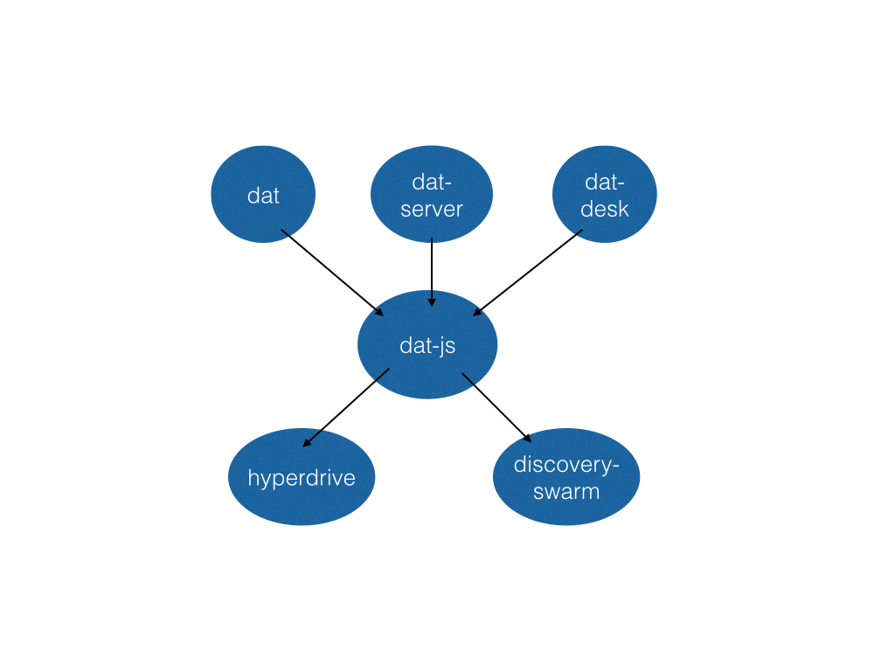

## 1.0 Architecture Design




  * dat: command-line
  * dat-desk: desktop application
  * dat-server: http and ui frontend
  * dat-js: JS api
  * hyperdrive: storage layer
  * discovery-swarm: swarm


## dat

Command-line interface for dat

#### `dat link DIR`

Create a new link for the contents of a directory and begin automatically serving the data to a swarm in the background.

  * `--foreground`: run the server in the foreground instead.

#### `dat download LINK DIR`

Download a link to a directory and begin automatically serving the data to a swarm in the background.

  * `--foreground`: run the server in the foreground instead.

#### `dat start`

Starts serving dats in the background progress.

  * `--foreground`: run the server in the foreground instead.

#### `dat stop`

Stops serving dats.

#### `dat rm LINK`

Remove a link from the list, stops serving it.

#### `dat ls`

View a static list of the current dat links that are served.

#### `dat mon`

Opens up real-time monitoring panel for viewing progress of running dats. Can provide optional parameter `dat mon LINK` to filter the monitor and logs for a given dat link.


## dat-js

A common JavaScript API for Dat.

```
var Dat = require('dat-js')
```

#### `var dat = Dat(opts, cb)`

Options

  * `db`: leveldb instance for underlying hyperdrive
  * `DISCOVERY_SERVER`: the discovery server to use. (default 'discovery1.publicbits.org')
  * `DAT_DOMAIN`: the domain to use (default 'dat.local')

#### `dat.link(dir, cb)`

Create a dat link for the given directory. Does not start sharing the dat. Must use `dat.join` to begin serving the link to the swarm.

```js
var linker = dat.link(dir)
var done = function (err, link) {
  if (err) throw err
  console.log('Done linking!', link)
}
var dir = '/Users/karissa/data/mydata'
var linker = dat.link(dir, done)
linker.on('progress', function (progress) {
  console.log('progress item', progress)
})
```

#### `dat.download(link, dir, cb)`

Download the given link to a given location. Get progress events from the stream. Progress events are the same as emitted by the `dat` object.

```js
var done = function (err) {
  if (err) throw err
  console.log('Done downloading!')
}
var link = 'dat://8a82dae10ee8384'
var dir = '/Users/karissa/data/mydata'
var downloader = dat.download(link, dir, done)
downloader.on('progress', function (progress) {
  console.log('progress item', progress)
})
```

#### `dat.join(link, cb)`

Join a swarm for the given link. Should be called after `link` or `download`. Throws error if data has not been downloaded or linked.

#### `dat.leave(link, cb)`

Leave the swarm for the given link.

#### `dat.on('progress', cb)`

Get all progress events from uploading and downloading data.

```js
dat.on('progress', function (progress) {
  console.log(progress)
})
```
